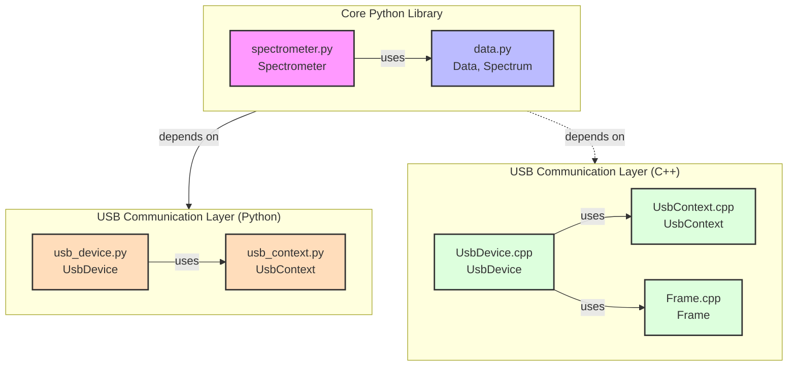
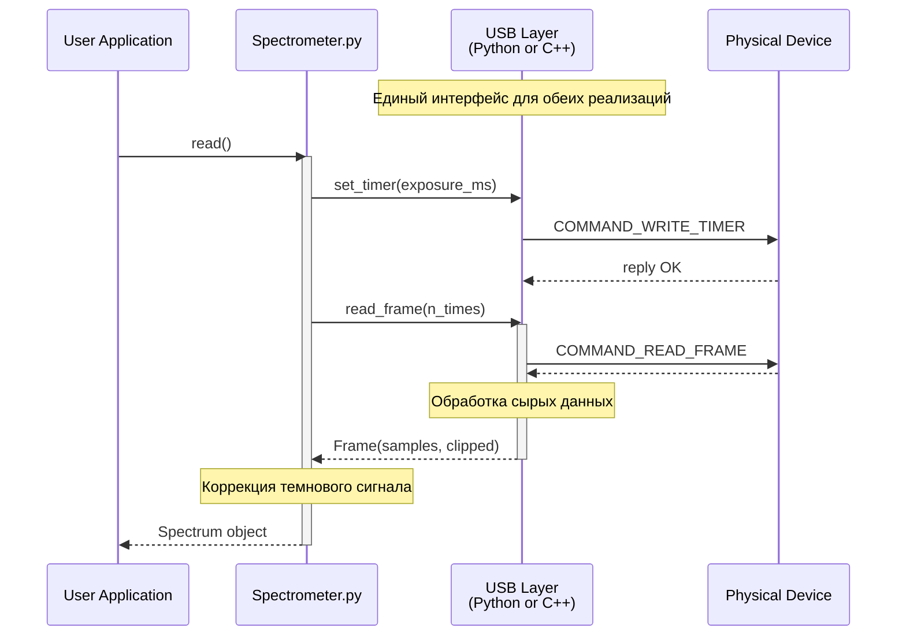

---
hide:
- toc
---

# Архитектурный обзор

!!! abstract "Общая структура"
    Библиотека разделена на два основных компонента:

    **Core Python Library**
    : Основная функциональность спектрометра (обработка данных и высокоуровневое управление)
    
    **USB Communication Layer**
    : Слой коммуникации с USB-устройством (реализации на Python и C++)

## 🏗️ Компонентная архитектура

!!! info "Платформенная специфика"
    - 🪟 **Windows**: Использует Python-реализацию USB-слоя
    - 🐧 **Linux**: Использует C++-реализацию USB-слоя
    - 🍎 **macOS**: Не поддерживается

## 📦 Компоненты библиотеки

### Core Python Library

#### 🌈 Spectrometer (spectrometer.py)

- Высокоуровневый интерфейс управления
- Конфигурация и калибровка
- Координация сбора данных
- Абстракция над USB-слоем

#### 📊 Data & Spectrum (data.py)

- Структуры данных измерений
- Математические операции
- Персистентность данных

### USB Communication Layer (Python)

#### 🔌 UsbDevice (usb_device.py)

- Реализация протокола устройства
- Управление конфигурацией
- Обработка кадров данных

#### 🛠️ UsbContext (usb_context.py)

- Низкоуровневые USB операции
- Управление подключением
- Работа с ftd2xx

### USB Communication Layer (C++)

#### 🔌 UsbDevice (UsbDevice.cpp)

- C++ реализация протокола
- Управление устройством
- Интеграция через pybind11

#### 🛠️ UsbContext (UsbContext.cpp)

- Нативные USB операции
- Работа с libftdi

#### 📥 Frame (Frame.cpp)

- Структура кадра данных
- Конвертация в numpy

## 🔄 Поток данных

!!! tip "Ключевые особенности"
    - 🔄 Единый интерфейс для обеих реализаций USB-слоя
    - 🔒 Изоляция платформо-зависимого кода
    - 📊 Унифицированная обработка данных
